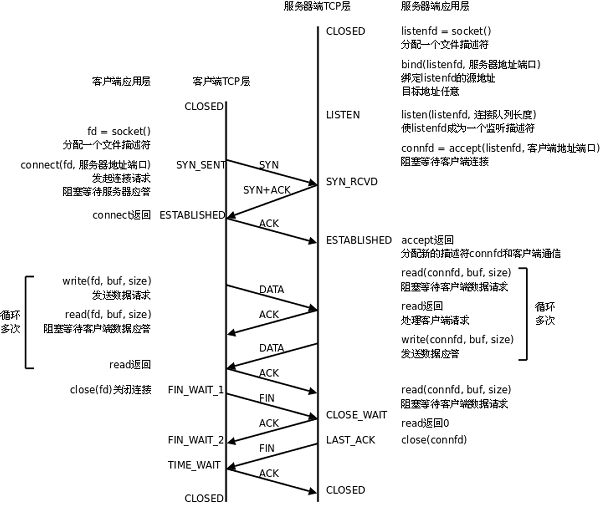

# 2. 基于 TCP 协议的网络程序

下图是基于 TCP 协议的客户端/服务器程序的一般流程：

<div align="center">

  

  <p><b>图 37.2. TCP 协议通讯流程</b></p>

</div>

服务器调用 socket()、bind()、listen()完成初始化后，调用 accept()阻塞等待，处于监听端口的状态，客户端调用 socket()初始化后，调用 connect()发出 SYN 段并阻塞等待服务器应答，服务器应答一个 SYN-ACK 段，客户端收到后从 connect()返回，同时应答一个 ACK 段，服务器收到后从 accept()返回。

数据传输的过程：

建立连接后，TCP 协议提供全双工的通信服务，但是一般的客户端/服务器程序的流程是由客户端主动发起请求，服务器被动处理请求，一问一答的方式。因此，服务器从 accept()返回后立刻调用 read()，读 socket 就像读管道一样，如果没有数据到达就阻塞等待，这时客户端调用 write()发送请求给服务器，服务器收到后从 read()返回，对客户端的请求进行处理，在此期间客户端调用 read()阻塞等待服务器的应答，服务器调用 write()将处理结果发回给客户端，再次调用 read()阻塞等待下一条请求，客户端收到后从 read()返回，发送下一条请求，如此循环下去。

如果客户端没有更多的请求了，就调用 close()关闭连接，就像写端关闭的管道一样，服务器的 read()返回 0，这样服务器就知道客户端关闭了连接，也调用 close()关闭连接。注意，任何一方调用 close()后，连接的两个传输方向都关闭，不能再发送数据了。如果一方调用 shutdown()则连接处于半关闭状态，仍可接收对方发来的数据。

在学习 socket API 时要注意应用程序和 TCP 协议层是如何交互的：

*应用程序调用某个 socket 函数时 TCP 协议层完成什么动作，比如调用 connect()会发出 SYN 段

*应用程序如何知道 TCP 协议层的状态变化，比如从某个阻塞的 socket 函数返回就表明 TCP 协议收到了某些段，再比如 read()返回 0 就表明收到了 FIN 段

## 2.1. 最简单的 TCP 网络程序

下面通过最简单的客户端/服务器程序的实例来学习 socket API。

server.c 的作用是从客户端读字符，然后将每个字符转换为大写并回送给客户端。

```c
/* server.c */
#include <stdio.h>
#include <stdlib.h>
#include <string.h>
#include <unistd.h>
#include <sys/socket.h>
#include <netinet/in.h>

#define MAXLINE 80
#define SERV_PORT 8000

int main(void)
{
	struct sockaddr_in servaddr, cliaddr;
	socklen_t cliaddr_len;
	int listenfd, connfd;
	char buf[MAXLINE];
	char str[INET_ADDRSTRLEN];
	int i, n;

	listenfd = socket(AF_INET, SOCK_STREAM, 0);

	bzero(&servaddr, sizeof(servaddr));
	servaddr.sin_family = AF_INET;
	servaddr.sin_addr.s_addr = htonl(INADDR_ANY);
	servaddr.sin_port = htons(SERV_PORT);

	bind(listenfd, (struct sockaddr *)&servaddr, sizeof(servaddr));

	listen(listenfd, 20);

	printf("Accepting connections ...\n");
	while (1) {
		cliaddr_len = sizeof(cliaddr);
		connfd = accept(listenfd,
				(struct sockaddr *)&cliaddr, &cliaddr_len);

		n = read(connfd, buf, MAXLINE);
		printf("received from %s at PORT %d\n",
		       inet_ntop(AF_INET, &cliaddr.sin_addr, str, sizeof(str)),
		       ntohs(cliaddr.sin_port));

		for (i = 0; i < n; i++)
			buf[i] = toupper(buf[i]);
		write(connfd, buf, n);
		close(connfd);
	}
}
```

下面介绍程序中用到的 socket API，这些函数都在 `sys/socket.h` 中。

```c
int socket(int family, int type, int protocol);
```

socket()打开一个网络通讯端口，如果成功的话，就像 open()一样返回一个文件描述符，应用程序可以像读写文件一样用 read/write 在网络上收发数据，如果 socket()调用出错则返回-1。对于 IPv4，family 参数指定为 AF_INET。对于 TCP 协议，type 参数指定为 SOCK_STREAM，表示面向流的传输协议。如果是 UDP 协议，则 type 参数指定为 SOCK_DGRAM，表示面向数据报的传输协议。protocol 参数的介绍从略，指定为 0 即可。

```c
int bind(int sockfd, const struct sockaddr *myaddr, socklen_t addrlen);
```

服务器程序所监听的网络地址和端口号通常是固定不变的，客户端程序得知服务器程序的地址和端口号后就可以向服务器发起连接，因此服务器需要调用 bind 绑定一个固定的网络地址和端口号。bind()成功返回 0，失败返回-1。

bind()的作用是将参数 sockfd 和 myaddr 绑定在一起，使 sockfd 这个用于网络通讯的文件描述符监听 myaddr 所描述的地址和端口号。前面讲过，struct sockaddr *是一个通用指针类型，myaddr 参数实际上可以接受多种协议的 sockaddr 结构体，而它们的长度各不相同，所以需要第三个参数 addrlen 指定结构体的长度。我们的程序中对 myaddr 参数是这样初始化的：

```c
bzero(&servaddr, sizeof(servaddr));
servaddr.sin_family = AF_INET;
servaddr.sin_addr.s_addr = htonl(INADDR_ANY);
servaddr.sin_port = htons(SERV_PORT);
```

首先将整个结构体清零，然后设置地址类型为 AF_INET，网络地址为 INADDR_ANY，这个宏表示本地的任意 IP 地址，因为服务器可能有多个网卡，每个网卡也可能绑定多个 IP 地址，这样设置可以在所有的 IP 地址上监听，直到与某个客户端建立了连接时才确定下来到底用哪个 IP 地址，端口号为 SERV_PORT，我们定义为 8000。

```c
int listen(int sockfd, int backlog);
```

典型的服务器程序可以同时服务于多个客户端，当有客户端发起连接时，服务器调用的 accept()返回并接受这个连接，如果有大量的客户端发起连接而服务器来不及处理，尚未 accept 的客户端就处于连接等待状态，listen()声明 sockfd 处于监听状态，并且最多允许有 backlog 个客户端处于连接待状态，如果接收到更多的连接请求就忽略。listen()成功返回 0，失败返回-1。

```c
int accept(int sockfd, struct sockaddr *cliaddr, socklen_t *addrlen);
```

三方握手完成后，服务器调用 accept()接受连接，如果服务器调用 accept()时还没有客户端的连接请求，就阻塞等待直到有客户端连接上来。cliaddr 是一个传出参数，accept()返回时传出客户端的地址和端口号。addrlen 参数是一个传入传出参数（value-result argument），传入的是调用者提供的缓冲区 cliaddr 的长度以避免缓冲区溢出问题，传出的是客户端地址结构体的实际长度（有可能没有占满调用者提供的缓冲区）。如果给 cliaddr 参数传 NULL，表示不关心客户端的地址。

我们的服务器程序结构是这样的：

```c
while (1) {
	cliaddr_len = sizeof(cliaddr);
	connfd = accept(listenfd,
			(struct sockaddr *)&cliaddr, &cliaddr_len);
	n = read(connfd, buf, MAXLINE);
	...
	close(connfd);
}
```

整个是一个 while 死循环，每次循环处理一个客户端连接。由于 cliaddr_len 是传入传出参数，每次调用 accept()之前应该重新赋初值。accept()的参数 listenfd 是先前的监听文件描述符，而 accept()的返回值是另外一个文件描述符 connfd，之后与客户端之间就通过这个 connfd 通讯，最后关闭 connfd 断开连接，而不关闭 listenfd，再次回到循环开头 listenfd 仍然用作 accept 的参数。accept()成功返回一个文件描述符，出错返回-1。

client.c 的作用是从命令行参数中获得一个字符串发给服务器，然后接收服务器返回的字符串并打印。

```c
/* client.c */
#include <stdio.h>
#include <stdlib.h>
#include <string.h>
#include <unistd.h>
#include <sys/socket.h>
#include <netinet/in.h>

#define MAXLINE 80
#define SERV_PORT 8000

int main(int argc, char *argv[])
{
	struct sockaddr_in servaddr;
	char buf[MAXLINE];
	int sockfd, n;
	char *str;

	if (argc != 2) {
		fputs("usage: ./client message\n", stderr);
		exit(1);
	}
	str = argv[1];

	sockfd = socket(AF_INET, SOCK_STREAM, 0);

	bzero(&servaddr, sizeof(servaddr));
	servaddr.sin_family = AF_INET;
	inet_pton(AF_INET, "127.0.0.1", &servaddr.sin_addr);
	servaddr.sin_port = htons(SERV_PORT);

	connect(sockfd, (struct sockaddr *)&servaddr, sizeof(servaddr));

	write(sockfd, str, strlen(str));

	n = read(sockfd, buf, MAXLINE);
	printf("Response from server:\n");
	write(STDOUT_FILENO, buf, n);

	close(sockfd);
	return 0;
}
```

由于客户端不需要固定的端口号，因此不必调用 bind()，客户端的端口号由内核自动分配。注意，客户端不是不允许调用 bind()，只是没有必要调用 bind()固定一个端口号，服务器也不是必须调用 bind()，但如果服务器不调用 bind()，内核会自动给服务器分配监听端口，每次启动服务器时端口号都不一样，客户端要连接服务器就会遇到麻烦。

```c
int connect(int sockfd, const struct sockaddr *servaddr, socklen_t addrlen);
```

客户端需要调用 connect()连接服务器，connect 和 bind 的参数形式一致，区别在于 bind 的参数是自己的地址，而 connect 的参数是对方的地址。connect()成功返回 0，出错返回-1。

先编译运行服务器:

```text
$ ./server
 Accepting connections ...
```

然后在另一个终端里用 netstat 命令查看：

```text
$ netstat -apn|grep 8000
 tcp        0      0 0.0.0.0:8000            0.0.0.0:*               LISTEN     8148/server
```

可以看到 server 程序监听 8000 端口，IP 地址还没确定下来。现在编译运行客户端：

```text
$ ./client abcd
Response from server:
ABCD
```

回到 server 所在的终端，看看 server 的输出：

```text
$ ./server
 Accepting connections ...
 received from 127.0.0.1 at PORT 59757
```

可见客户端的端口号是自动分配的。现在把客户端所连接的服务器 IP 改为其它主机的 IP，试试两台主机的通讯。

再做一个小实验，在客户端的 connect()代码之后插一个 while(1);死循环，使客户端和服务器都处于连接中的状态，用 netstat 命令查看：

```text
$ ./server &
[1] 8343
$ Accepting connections ...
./client abcd &
[2] 8344
$ netstat -apn|grep 8000
tcp        0      0 0.0.0.0:8000            0.0.0.0:*               LISTEN     8343/server
tcp        0      0 127.0.0.1:44406         127.0.0.1:8000          ESTABLISHED8344/client
tcp        0      0 127.0.0.1:8000          127.0.0.1:44406         ESTABLISHED8343/server
```

应用程序中的一个 socket 文件描述符对应一个 socket pair，也就是源地址:源端口号和目的地址:目的端口号，也对应一个 TCP 连接。

**表 37.1. client 和 server 的 socket 状态**

| socket 文件描述符 | 源地址:源端口号 | 目的地址:目的端口号 | 状态 |
| --- | --- | --- | --- |
| server.c 中的 listenfd | 0.0.0.0:8000 | 0.0.0.0:* | LISTEN |
| server.c 中的 connfd | 127.0.0.1:8000 | 127.0.0.1:44406 | ESTABLISHED |
| client.c 中的 sockfd | 127.0.0.1:44406 | 127.0.0.1:8000 | ESTABLISHED |

## 2.2. 错误处理与读写控制

上面的例子不仅功能简单，而且简单到几乎没有什么错误处理，我们知道，系统调用不能保证每次都成功，必须进行出错处理，这样一方面可以保证程序逻辑正常，另一方面可以迅速得到故障信息。

为使错误处理的代码不影响主程序的可读性，我们把与 socket 相关的一些系统函数加上错误处理代码包装成新的函数，做成一个模块 wrap.c：

```c
#include <stdlib.h>
#include <errno.h>
#include <sys/socket.h>

void perr_exit(const char *s)
{
	perror(s);
	exit(1);
}

int Accept(int fd, struct sockaddr *sa, socklen_t *salenptr)
{
	int n;

again:
	if ( (n = accept(fd, sa, salenptr)) < 0) {
		if ((errno == ECONNABORTED) || (errno == EINTR))
			goto again;
		else
			perr_exit("accept error");
	}
	return n;
}

void Bind(int fd, const struct sockaddr *sa, socklen_t salen)
{
	if (bind(fd, sa, salen) < 0)
		perr_exit("bind error");
}

void Connect(int fd, const struct sockaddr *sa, socklen_t salen)
{
	if (connect(fd, sa, salen) < 0)
		perr_exit("connect error");
}

void Listen(int fd, int backlog)
{
	if (listen(fd, backlog) < 0)
		perr_exit("listen error");
}

int Socket(int family, int type, int protocol)
{
	int n;

	if ( (n = socket(family, type, protocol)) < 0)
		perr_exit("socket error");
	return n;
}

ssize_t Read(int fd, void *ptr, size_t nbytes)
{
	ssize_t n;

again:
	if ( (n = read(fd, ptr, nbytes)) == -1) {
		if (errno == EINTR)
			goto again;
		else
			return -1;
	}
	return n;
}

ssize_t Write(int fd, const void *ptr, size_t nbytes)
{
	ssize_t n;

again:
	if ( (n = write(fd, ptr, nbytes)) == -1) {
		if (errno == EINTR)
			goto again;
		else
			return -1;
	}
	return n;
}

void Close(int fd)
{
	if (close(fd) == -1)
		perr_exit("close error");
}
```

慢系统调用 accept、read 和 write 被信号中断时应该重试。connect 虽然也会阻塞，但是被信号中断时不能立刻重试。对于 accept，如果 errno 是 ECONNABORTED，也应该重试。详细解释见参考资料。

TCP 协议是面向流的，read 和 write 调用的返回值往往小于参数指定的字节数。对于 read 调用，如果接收缓冲区中有 20 字节，请求读 100 个字节，就会返回 20。对于 write 调用，如果请求写 100 个字节，而发送缓冲区中只有 20 个字节的空闲位置，那么 write 会阻塞，直到把 100 个字节全部交给发送缓冲区才返回，但如果 socket 文件描述符有 O_NONBLOCK 标志，则 write 不阻塞，直接返回 20。为避免这些情况干扰主程序的逻辑，确保读写我们所请求的字节数，我们实现了两个包装函数 readn 和 writen，也放在 wrap.c 中：

```c
ssize_t Readn(int fd, void *vptr, size_t n)
{
	size_t  nleft;
	ssize_t nread;
	char   *ptr;

	ptr = vptr;
	nleft = n;
	while (nleft > 0) {
		if ( (nread = read(fd, ptr, nleft)) < 0) {
			if (errno == EINTR)
				nread = 0;
			else
				return -1;
		} else if (nread == 0)
			break;

		nleft -= nread;
		ptr += nread;
	}
	return n - nleft;
}

ssize_t Writen(int fd, const void *vptr, size_t n)
{
	size_t nleft;
	ssize_t nwritten;
	const char *ptr;

	ptr = vptr;
	nleft = n;
	while (nleft > 0) {
		if ( (nwritten = write(fd, ptr, nleft)) <= 0) {
			if (nwritten < 0 && errno == EINTR)
				nwritten = 0;
			else
				return -1;
		}

		nleft -= nwritten;
		ptr += nwritten;
	}
	return n;
}
```

如果应用层协议的各字段长度固定，用 readn 来读是非常方便的。例如设计一种客户端上传文件的协议，规定前 12 字节表示文件名，超过 12 字节的文件名截断，不足 12 字节的文件名用'\0'补齐，从第 13 字节开始是文件内容，上传完所有文件内容后关闭连接，服务器可以先调用 readn 读 12 个字节，根据文件名创建文件，然后在一个循环中调用 read 读文件内容并存盘，循环结束的条件是 read 返回 0。

字段长度固定的协议往往不够灵活，难以适应新的变化。比如，以前 DOS 的文件名是 8 字节主文件名加“.”加 3 字节扩展名，不超过 12 字节，但是现代操作系统的文件名可以长得多，12 字节就不够用了。那么制定一个新版本的协议规定文件名字段为 256 字节怎么样？这样又造成很大的浪费，因为大多数文件名都很短，需要用大量的'\0'补齐 256 字节，而且新版本的协议和老版本的程序无法兼容，如果已经有很多人在用老版本的程序了，会造成遵循新协议的程序与老版本程序的互操作性（Interoperability）问题。如果新版本的协议要添加新的字段，比如规定前 12 字节是文件名，从 13 到 16 字节是文件类型说明，从第 17 字节开始才是文件内容，同样会造成和老版本的程序无法兼容的问题。

现在重新看看上一节的 TFTP 协议是如何避免上述问题的：TFTP 协议的各字段是可变长的，以'\0'为分隔符，文件名可以任意长，再看 blksize 等几个选项字段，TFTP 协议并没有规定从第 m 字节到第 n 字节是 blksize 的值，而是把选项的描述信息“blksize”与它的值“512”一起做成一个可变长的字段，这样，以后添加新的选项仍然可以和老版本的程序兼容（老版本的程序只要忽略不认识的选项就行了）。

因此，常见的应用层协议都是带有可变长字段的，字段之间的分隔符用换行的比用'\0'的更常见，例如本节后面要介绍的 HTTP 协议。可变长字段的协议用 readn 来读就很不方便了，为此我们实现一个类似于 fgets 的 readline 函数，也放在 wrap.c 中：

```c
static ssize_t my_read(int fd, char *ptr)
{
	static int read_cnt;
	static char *read_ptr;
	static char read_buf[100];

	if (read_cnt <= 0) {
	again:
		if ( (read_cnt = read(fd, read_buf, sizeof(read_buf))) < 0) {
			if (errno == EINTR)
				goto again;
			return -1;
		} else if (read_cnt == 0)
			return 0;
		read_ptr = read_buf;
	}
	read_cnt--;
	*ptr = *read_ptr++;
	return 1;
}

ssize_t Readline(int fd, void *vptr, size_t maxlen)
{
	ssize_t n, rc;
	char    c, *ptr;

	ptr = vptr;
	for (n = 1; n < maxlen; n++) {
		if ( (rc = my_read(fd, &c)) == 1) {
			*ptr++ = c;
			if (c  == '\n')
				break;
		} else if (rc == 0) {
			*ptr = 0;
			return n - 1;
		} else
			return -1;
	}
	*ptr  = 0;
	return n;
}
```

## 习题

1、请读者自己写出 wrap.c 的头文件 wrap.h，后面的网络程序代码都要用到这个头文件。

2、修改 server.c 和 client.c，添加错误处理。

## 2.3. 把 client 改为交互式输入

目前实现的 client 每次运行只能从命令行读取一个字符串发给服务器，再从服务器收回来，现在我们把它改成交互式的，不断从终端接受用户输入并和 server 交互。

```c
/* client.c */
#include <stdio.h>
#include <string.h>
#include <unistd.h>
#include <netinet/in.h>
#include "wrap.h"

#define MAXLINE 80
#define SERV_PORT 8000

int main(int argc, char *argv[])
{
	struct sockaddr_in servaddr;
	char buf[MAXLINE];
	int sockfd, n;

	sockfd = Socket(AF_INET, SOCK_STREAM, 0);

	bzero(&servaddr, sizeof(servaddr));
	servaddr.sin_family = AF_INET;
	inet_pton(AF_INET, "127.0.0.1", &servaddr.sin_addr);
	servaddr.sin_port = htons(SERV_PORT);

	Connect(sockfd, (struct sockaddr *)&servaddr, sizeof(servaddr));

	while (fgets(buf, MAXLINE, stdin) != NULL) {
		Write(sockfd, buf, strlen(buf));
		n = Read(sockfd, buf, MAXLINE);
		if (n == 0)
			printf("the other side has been closed.\n");
		else
			Write(STDOUT_FILENO, buf, n);
	}

	Close(sockfd);
	return 0;
}
```

编译并运行 server 和 client，看看是否达到了你预想的结果。

```text
$ ./client
haha1
HAHA1
haha2
the other side has been closed.
haha3
$
```

这时 server 仍在运行，但是 client 的运行结果并不正确。原因是什么呢？仔细查看 server.c 可以发现，server 对每个请求只处理一次，应答后就关闭连接，client 不能继续使用这个连接发送数据。但是 client 下次循环时又调用 write 发数据给 server，write 调用只负责把数据交给 TCP 发送缓冲区就可以成功返回了，所以不会出错，而 server 收到数据后应答一个 RST 段，client 收到 RST 段后无法立刻通知应用层，只把这个状态保存在 TCP 协议层。client 下次循环又调用 write 发数据给 server，由于 TCP 协议层已经处于 RST 状态了，因此不会将数据发出，而是发一个 SIGPIPE 信号给应用层，SIGPIPE 信号的缺省处理动作是终止程序，所以看到上面的现象。

为了避免 client 异常退出，上面的代码应该在判断对方关闭了连接后 break 出循环，而不是继续 write。另外，有时候代码中需要连续多次调用 write，可能还来不及调用 read 得知对方已关闭了连接就被 SIGPIPE 信号终止掉了，这就需要在初始化时调用 sigaction 处理 SIGPIPE 信号，如果 SIGPIPE 信号没有导致进程异常退出，write 返回-1 并且 errno 为 EPIPE。

另外，我们需要修改 server，使它可以多次处理同一客户端的请求。

```c
/* server.c */
#include <stdio.h>
#include <string.h>
#include <netinet/in.h>
#include "wrap.h"

#define MAXLINE 80
#define SERV_PORT 8000

int main(void)
{
	struct sockaddr_in servaddr, cliaddr;
	socklen_t cliaddr_len;
	int listenfd, connfd;
	char buf[MAXLINE];
	char str[INET_ADDRSTRLEN];
	int i, n;

	listenfd = Socket(AF_INET, SOCK_STREAM, 0);

	bzero(&servaddr, sizeof(servaddr));
	servaddr.sin_family = AF_INET;
	servaddr.sin_addr.s_addr = htonl(INADDR_ANY);
	servaddr.sin_port = htons(SERV_PORT);

	Bind(listenfd, (struct sockaddr *)&servaddr, sizeof(servaddr));

	Listen(listenfd, 20);

	printf("Accepting connections ...\n");
	while (1) {
		cliaddr_len = sizeof(cliaddr);
		connfd = Accept(listenfd,
				(struct sockaddr *)&cliaddr, &cliaddr_len);
		while (1) {
			n = Read(connfd, buf, MAXLINE);
			if (n == 0) {
				printf("the other side has been closed.\n");
				break;
			}
			printf("received from %s at PORT %d\n",
			       inet_ntop(AF_INET, &cliaddr.sin_addr, str, sizeof(str)),
			       ntohs(cliaddr.sin_port));

			for (i = 0; i < n; i++)
				buf[i] = toupper(buf[i]);
			Write(connfd, buf, n);
		}
		Close(connfd);
	}
}
```

经过上面的修改后，客户端和服务器可以进行多次交互了。我们知道，服务器通常是要同时服务多个客户端的，运行上面的 server 和 client 之后，再开一个终端运行 client 试试，新的 client 能得到服务吗？想想为什么。

## 2.4. 使用 fork 并发处理多个 client 的请求

怎么解决这个问题？网络服务器通常用 fork 来同时服务多个客户端，父进程专门负责监听端口，每次 accept 一个新的客户端连接就 fork 出一个子进程专门服务这个客户端。但是子进程退出时会产生僵尸进程，父进程要注意处理 SIGCHLD 信号和调用 wait 清理僵尸进程。

以下给出代码框架，完整的代码请读者自己完成。

```c
listenfd = socket(...);
bind(listenfd, ...);
listen(listenfd, ...);
while (1) {
	connfd = accept(listenfd, ...);
	n = fork();
	if (n == -1) {
		perror("call to fork");
		exit(1);
	} else if (n == 0) {
		close(listenfd);
		while (1) {
			read(connfd, ...);
			...
			write(connfd, ...);
		}
		close(connfd);
		exit(0);
	} else
		close(connfd);
}
```

## 2.5. setsockopt

现在做一个测试，首先启动 server，然后启动 client，然后用 Ctrl-C 使 server 终止，这时马上再运行 server，结果是：

```text
$ ./server
 bind error: Address already in use
```

这是因为，虽然 server 的应用程序终止了，但 TCP 协议层的连接并没有完全断开，因此不能再次监听同样的 server 端口。我们用 netstat 命令查看一下：

```text
$ netstat -apn |grep 8000
 tcp        1      0 127.0.0.1:33498         127.0.0.1:8000          CLOSE_WAIT 10830/client
 tcp        0      0 127.0.0.1:8000          127.0.0.1:33498         FIN_WAIT2  -
```

server 终止时，socket 描述符会自动关闭并发 FIN 段给 client，client 收到 FIN 后处于 CLOSE_WAIT 状态，但是 client 并没有终止，也没有关闭 socket 描述符，因此不会发 FIN 给 server，因此 server 的 TCP 连接处于 FIN_WAIT2 状态。

现在用 Ctrl-C 把 client 也终止掉，再观察现象：

```text
$ netstat -apn |grep 8000
 tcp        0      0 127.0.0.1:8000          127.0.0.1:44685         TIME_WAIT  -
 $ ./server
 bind error: Address already in use
```

client 终止时自动关闭 socket 描述符，server 的 TCP 连接收到 client 发的 FIN 段后处于 TIME_WAIT 状态。TCP 协议规定，主动关闭连接的一方要处于 TIME_WAIT 状态，等待两个 MSL（maximum segment lifetime）的时间后才能回到 CLOSED 状态，因为我们先 Ctrl-C 终止了 server，所以 server 是主动关闭连接的一方，在 TIME_WAIT 期间仍然不能再次监听同样的 server 端口。MSL 在 RFC1122 中规定为两分钟，但是各操作系统的实现不同，在 Linux 上一般经过半分钟后就可以再次启动 server 了。至于为什么要规定 TIME_WAIT 的时间请读者参考 UNP 2.7 节。

在 server 的 TCP 连接没有完全断开之前不允许重新监听是不合理的，因为，TCP 连接没有完全断开指的是 connfd（127.0.0.1:8000）没有完全断开，而我们重新监听的是 listenfd（0.0.0.0:8000），虽然是占用同一个端口，但 IP 地址不同，connfd 对应的是与某个客户端通讯的一个具体的 IP 地址，而 listenfd 对应的是 wildcard address。解决这个问题的方法是使用 setsockopt()设置 socket 描述符的选项 SO_REUSEADDR 为 1，表示允许创建端口号相同但 IP 地址不同的多个 socket 描述符。在 server 代码的 socket()和 bind()调用之间插入如下代码：

```c
int opt = 1;
setsockopt(listenfd, SOL_SOCKET, SO_REUSEADDR, &opt, sizeof(opt));
```

有关 setsockopt 可以设置的其它选项请参考 UNP 第 7 章。

## 2.6. 使用 select

select 是网络程序中很常用的一个系统调用，它可以同时监听多个阻塞的文件描述符（例如多个网络连接），哪个有数据到达就处理哪个，这样，不需要 fork 和多进程就可以实现并发服务的 server。

```c
/* server.c */
#include <stdio.h>
#include <stdlib.h>
#include <string.h>
#include <netinet/in.h>
#include "wrap.h"

#define MAXLINE 80
#define SERV_PORT 8000

int main(int argc, char **argv)
{
	int i, maxi, maxfd, listenfd, connfd, sockfd;
	int nready, client[FD_SETSIZE];
	ssize_t n;
	fd_set rset, allset;
	char buf[MAXLINE];
	char str[INET_ADDRSTRLEN];
	socklen_t cliaddr_len;
	struct sockaddr_in	cliaddr, servaddr;

	listenfd = Socket(AF_INET, SOCK_STREAM, 0);

	bzero(&servaddr, sizeof(servaddr));
	servaddr.sin_family      = AF_INET;
	servaddr.sin_addr.s_addr = htonl(INADDR_ANY);
	servaddr.sin_port        = htons(SERV_PORT);

	Bind(listenfd, (struct sockaddr *)&servaddr, sizeof(servaddr));

	Listen(listenfd, 20);

	maxfd = listenfd;		/* initialize */
	maxi = -1;			/* index into client[] array */
	for (i = 0; i < FD_SETSIZE; i++)
		client[i] = -1;	/* -1 indicates available entry */
	FD_ZERO(&allset);
	FD_SET(listenfd, &allset);

	for ( ; ; ) {
		rset = allset;	/* structure assignment */
		nready = select(maxfd+1, &rset, NULL, NULL, NULL);
		if (nready < 0)
			perr_exit("select error");

		if (FD_ISSET(listenfd, &rset)) { /* new client connection */
			cliaddr_len = sizeof(cliaddr);
			connfd = Accept(listenfd, (struct sockaddr *)&cliaddr, &cliaddr_len);

			printf("received from %s at PORT %d\n",
			       inet_ntop(AF_INET, &cliaddr.sin_addr, str, sizeof(str)),
			       ntohs(cliaddr.sin_port));

			for (i = 0; i < FD_SETSIZE; i++)
				if (client[i] < 0) {
					client[i] = connfd; /* save descriptor */
					break;
				}
			if (i == FD_SETSIZE) {
				fputs("too many clients\n", stderr);
				exit(1);
			}

			FD_SET(connfd, &allset);	/* add new descriptor to set */
			if (connfd > maxfd)
				maxfd = connfd; /* for select */
			if (i > maxi)
				maxi = i;	/* max index in client[] array */

			if (--nready == 0)
				continue;	/* no more readable descriptors */
		}

		for (i = 0; i <= maxi; i++) {	/* check all clients for data */
			if ( (sockfd = client[i]) < 0)
				continue;
			if (FD_ISSET(sockfd, &rset)) {
				if ( (n = Read(sockfd, buf, MAXLINE)) == 0) {
					/* connection closed by client */
					Close(sockfd);
					FD_CLR(sockfd, &allset);
					client[i] = -1;
				} else {
					int j;
					for (j = 0; j < n; j++)
						buf[j] = toupper(buf[j]);
					Write(sockfd, buf, n);
				}

				if (--nready == 0)
					break;	/* no more readable descriptors */
			}
		}
	}
}
```
