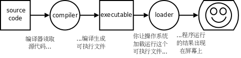
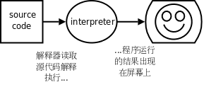

# 1. 程序和编程语言

程序（Program）告诉计算机应如何完成一个计算任务，这里的计算可以是数学运算，比如解方程，也可以是符号运算，比如查找和替换文档中的某个单词。从根本上说，计算机是由数字电路组成的运算机器，只能对数字做运算，程序之所以能做符号运算，是因为符号在计算机内部也是用数字表示的。此外，程序还可以处理声音和图像，声音和图像在计算机内部必然也是用数字表示的，这些数字经过专门的硬件设备转换成人可以听到、看到的声音和图像。

程序由一系列指令（Instruction）组成，指令是指示计算机做某种运算的命令，通常包括以下几类：

* 输入（Input）

  从键盘、文件或者其它设备获取数据。

* 输出（Output）

  把数据显示到屏幕，或者存入一个文件，或者发送到其它设备。

* 基本运算

  执行最基本的数学运算（加减乘除）和数据存取。

* 测试和分支

  测试某个条件，然后根据不同的测试结果执行不同的后续指令。

* 循环

  重复执行一系列操作。

对于程序来说，有上面这几类指令就足够了。你曾用过的任何一个程序，不管它有多么复杂，都是由这几类指令组成的。程序是那么的复杂，而编写程序可以用的指令却只有这么简单的几种，这中间巨大的落差就要由程序员去填了，所以编写程序理应是一件相当复杂的工作。**编写程序可以说就是这样一个过程：把复杂的任务分解成子任务，把子任务再分解成更简单的任务，层层分解，直到最后简单得可以用以上指令来完成。**

编程语言（Programming Language）分为低级语言（Low-level Language）和高级语言（High-level Language）。机器语言（Machine Language）和汇编语言（Assembly Language）属于低级语言，直接用计算机指令编写程序。而 C、C++、Java、Python 等属于高级语言，用语句（Statement）编写程序，语句是计算机指令的抽象表示。举个例子，同样一个语句用 C 语言、汇编语言和机器语言分别表示如下：

**表 1.1. 一个语句的三种表示**

| 编程语言 | 表示形式 |
| --- | --- |
| C 语言 | a=b+1; |
| 汇编语言 | mov 0x804a01c,%eax<br/>add $0x1,%eax<br/>mov %eax,0x804a018 |
| 机器语言 | a1 1c a0 04 08<br/>83 c0 01<br/>a3 18 a0 04 08 |

计算机只能对数字做运算，符号、声音、图像在计算机内部都要用数字表示，指令也不例外，上表中的机器语言完全由十六进制数字组成。最早的程序员都是直接用机器语言编程，但是很麻烦，需要查大量的表格来确定每个数字表示什么意思，编写出来的程序很不直观，而且容易出错，于是有了汇编语言，把机器语言中一组一组的数字用助记符（Mnemonic）表示，直接用这些助记符写出汇编程序，然后让汇编器（Assembler）去查表把助记符替换成数字，也就把汇编语言翻译成了机器语言。从上面的例子可以看出，汇编语言和机器语言的指令是一一对应的，汇编语言有三条指令，机器语言也有三条指令，汇编器就是做一个简单的替换工作，例如在第一条指令中，把 `movl ?,%eax` 这种格式的指令替换成机器码 `a1 ?` ，?表示一个地址，在汇编指令中是 `0x804a01c` ，转换成机器码之后是 `1c a0 04 08` （这是指令中的十六进制数的小端表示，小端表示将在[第 5.1 节 “目标文件”](ch18s05.md#asm.relocatable)介绍）。

从上面的例子还可以看出，C 语言的语句和低级语言的指令之间不是简单的一一对应关系，一条 `a=b+1;` 语句要翻译成三条汇编或机器指令，这个过程称为编译（Compile），由编译器（Compiler）来完成，显然编译器的功能比汇编器要复杂得多。用 C 语言编写的程序必须经过编译转成机器指令才能被计算机执行，编译需要花一些时间，这是用高级语言编程的一个缺点，然而更多的是优点。首先，用 C 语言编程更容易，写出来的代码更紧凑，可读性更强，出了错也更容易改正。其次，C 语言是可移植的（Portable）或者称为平台无关的（Platform Independent）。

平台这个词有很多种解释，可以指计算机体系结构（Architecture），也可以指操作系统（Operating System），也可以指开发平台（编译器、链接器等）。不同的计算机体系结构有不同的指令集（Instruction Set），可以识别的机器指令格式是不同的，直接用某种体系结构的汇编或机器指令写出来的程序只能在这种体系结构的计算机上运行，然而各种体系结构的计算机都有各自的 C 编译器，可以把 C 程序编译成各种不同体系结构的机器指令，这意味着用 C 语言写的程序只需稍加修改甚至不用修改就可以在各种不同的计算机上编译运行。各种高级语言都具有 C 语言的这些优点，所以绝大部分程序是用高级语言编写的，只有和硬件关系密切的少数程序（例如驱动程序）才会用到低级语言。还要注意一点，即使在相同的体系结构和操作系统下，用不同的 C 编译器（或者同一个 C 编译器的不同版本）编译同一个程序得到的结果也有可能不同，C 语言有些语法特性在 C 标准中并没有明确规定，各编译器有不同的实现，编译出来的指令的行为特性也会不同，应该尽量避免使用不可移植的语法特性。

总结一下编译执行的过程，首先你用文本编辑器写一个 C 程序，然后保存成一个文件，例如 `program.c` （通常 C 程序的文件名后缀是 `.c` ），这称为源代码（Source Code）或源文件，然后运行编译器对它进行编译，编译的过程并不执行程序，而是把源代码全部翻译成机器指令，再加上一些描述信息，生成一个新的文件，例如 `a.out` ，这称为可执行文件，可执行文件可以被操作系统加载运行，计算机执行该文件中由编译器生成的指令，如下图所示：

<div align="center">

  

  <p><b>图 1.1. 编译执行的过程</b></p>

</div>

有些高级语言以解释（Interpret）的方式执行，解释执行过程和 C 语言的编译执行过程很不一样。例如编写一个 Shell 脚本 `script.sh` ，内容如下：

```c
#! /bin/sh
VAR=1
VAR=$(($VAR+1))
echo $VAR
```

定义 Shell 变量 `VAR` 的初始值是 1，然后自增 1，然后打印 `VAR` 的值。用 Shell 程序 `/bin/sh` 解释执行这个脚本，结果如下：

```text
$ /bin/sh script.sh
2
```

这里的 `/bin/sh` 称为解释器（Interpreter），它把脚本中的每一行当作一条命令解释执行，而不需要先生成包含机器指令的可执行文件再执行。如果把脚本中的这三行当作三条命令直接敲到 Shell 提示符下，也能得到同样的结果：

```text
$ VAR=1
$ VAR=$(($VAR+1))
$ echo $VAR
2
```

<div align="center">

  

  <p><b>图 1.2. 解释执行的过程</b></p>

</div>

编程语言仍在发展演化。以上介绍的机器语言称为第一代语言（1GL，1st Generation Programming Language），汇编语言称为第二代语言（2GL，2nd Generation Programming Language），C、C++、Java、Python 等可以称为第三代语言（3GL，3rd Generation Programming Language）。目前已经有了 4GL（4th Generation Programming Language）和 5GL（5th Generation Programming Language）的概念。3GL 的编程语言虽然是用语句编程而不直接用指令编程，但语句也分为输入、输出、基本运算、测试分支和循环等几种，和指令有直接的对应关系。而 4GL 以后的编程语言更多是描述要做什么（Declarative）而不描述具体一步一步怎么做（Imperative），具体一步一步怎么做完全由编译器或解释器决定，例如 SQL 语言（SQL，Structured Query Language，结构化查询语言）就是这样的例子。

## 习题

1、解释执行的语言相比编译执行的语言有什么优缺点？

这是我们的第一个思考题。本书的思考题通常要求读者系统地总结当前小节的知识，结合以前的知识，并经过一定的推理，然后作答。本书强调的是基本概念，读者应该抓住概念的定义和概念之间的关系来总结，比如本节介绍了很多概念：**程序**由**语句**或**指令**组成，计算机只能执行**低级语言**中的**指令**（汇编语言的指令要先转成机器码才能执行），**高级语言**要执行就必须先翻译成低级语言，翻译的方法有两种－－**编译**和**解释**，虽然有这样的不便，但高级语言有一个好处是**平台无关性**。什么是**平台**？一种平台，就是一种**体系结构**，就是一种**指令集**，就是一种**机器语言**，这些都可看作是一一对应的，上文并没有用“一一对应”这个词，但读者应该能推理出这个结论，而高级语言和它们不是一一对应的，因此高级语言是**平台无关**的，概念之间像这样的数量对应关系尤其重要。那么编译和解释的过程有哪些不同？主要的不同在于什么时候翻译和什么时候执行。

现在回答这个思考题，根据编译和解释的不同原理，你能否在执行效率和平台无关性等方面做一下比较？

希望读者掌握**以概念为中心的阅读思考习惯**，每读一节就总结一套概念之间的关系图画在书上空白处。如果读到后面某一节看到一个讲过的概念，但是记不清在哪一节讲过了，没关系，书后的索引可以帮你找到它是在哪一节定义的。
